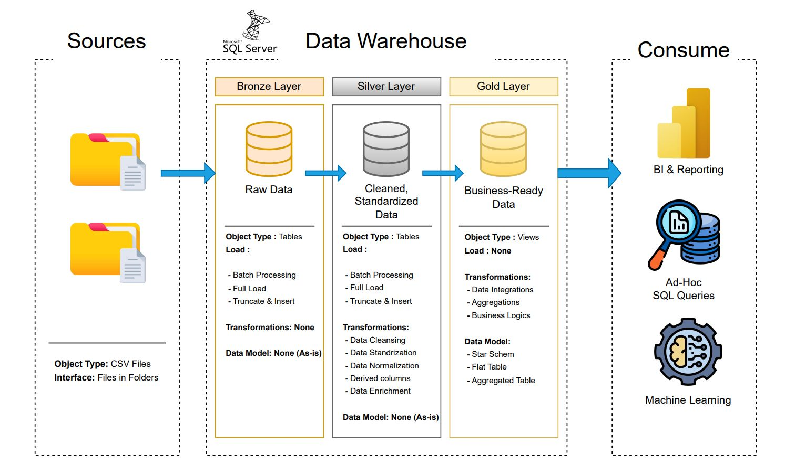

# Data-Warehouse & Analytics Projekt

Willkommen zu meinem **Data-Warehouse & Analytics Projekt**! 🚀  
Dieses Projekt war meine erste praktische Erfahrung mit Data-Warehousing-Prozessen, ETL-Pipelines und analytischen Auswertungen. Ziel war es, die Theorie aus dem Studium in die Praxis umzusetzen und ein vollständiges Data-Warehouse aufzubauen.

---

## 📖 Projektübersicht

In diesem Projekt habe ich folgende Aufgaben durchgeführt:

1. **Datenarchitektur**: Aufbau eines modernen Data Warehouses nach dem Medallion-Prinzip (**Bronze**, **Silver**, **Gold**).  
2. **ETL-Pipelines**: Extraktion, Transformation und Laden von Daten aus CSV-Dateien in das Data Warehouse.  
3. **Datenmodellierung**: Erstellung von Fakt- und Dimensionstabellen für analytische Abfragen.  
4. **Analysen & Reporting**: Generierung von SQL-basierten Reports und Dashboards zur Ableitung von Erkenntnissen.

🎯 Mit diesem Projekt habe ich erste praktische Kenntnisse erworben in:  
- SQL-Entwicklung
- ETL-Pipelines  
- Datenmodellierung (Star Schema)  
- Data-Warehouse-Prozesse
- Data Architektur & Engineering
- Data Analytics & Reporting  

---
## 🏗️ Datenarchitektur
Das Data-Warehouse folgt der **Medallion-Architektur**:

1. **Bronze Layer**: Rohdaten direkt aus CSV-Dateien.  
2. **Silver Layer**: Bereinigte und standardisierte Daten für Analysezwecke.  
3. **Gold Layer**: Geschäftsfertige Daten in einem Star-Schema für Reporting und BI.
   
---

## 🚀 Projektziele

## Aufbau des Data Warehouse (Data Engineering)

### 🎯 Zielsetzung
Entwicklung eines modernen **Data Warehouses** mit **SQL Server**, um Verkaufsdaten aus verschiedenen Quellen zu konsolidieren.  
Dadurch sollen analytische Berichte und datenbasierte Entscheidungen ermöglicht werden.

### 🧾 Spezifikationen
- **Datenquellen**: Import von Daten aus zwei Quellsystemen (**ERP** und **CRM**), bereitgestellt als CSV-Dateien.  
- **Datenqualität**: Bereinigung und Behebung von Datenqualitätsproblemen vor der Analyse.  
- **Integration**: Zusammenführung beider Quellen in ein einheitliches, benutzerfreundliches Datenmodell für analytische Abfragen.  
- **Umfang**: Fokus auf den aktuellen Datensatz – Historisierung der Daten ist nicht erforderlich.  
- **Dokumentation**: Klare Beschreibung des Datenmodells zur Unterstützung von Fachabteilungen und Analystenteams.  

---

## 📊 Business Intelligence & Reporting (Data Analysis)

### 🎯 Zielsetzung
Entwicklung von **SQL-basierten Analysen**, um detaillierte Einblicke in folgende Bereiche zu gewinnen:

- **Kundenverhalten**  
- **Produktleistung**  
- **Umsatztrends**

Diese Analysen liefern zentrale **Business-Kennzahlen**, die es Entscheidungsträgern ermöglichen, strategisch fundierte Entscheidungen zu treffen.


---
## 🛠️ Verwendete Tools & Ressourcen

- **[SQL Server Express](https://www.microsoft.com/en-us/sql-server/sql-server-downloads)**: Datenbankserver für die Umsetzung des Data Warehouses.  
- **[SQL Server Management Studio (SSMS)](https://learn.microsoft.com/en-us/sql/ssms/download-sql-server-management-studio-ssms?view=sql-server-ver16)**: GUI zur Verwaltung der Datenbanken.  
- **[Datasets](datasets/)**: CSV-Dateien als Datenquelle für das Projekt.  
- **[DrawIO](https://www.drawio.com/)**: Erstellung von Datenarchitektur- und Datenflussdiagrammen.  
- **[Notion Projektplan](https://thankful-pangolin-2ca.notion.site/SQL-Data-Warehouse-Project-16ed041640ef80489667cfe2f380b269?pvs=4)**: Strukturierung aller Projektphasen und Aufgaben.

  ---
## 📂 Repository-Struktur
```
sql-data-warehouse-warehouse-project/
│
├── datasets/ # CSV-Datenquellen
├── docs/ # Projekt-Dokumentation & Diagramme
│ ├── data_architecture.drawio
│ ├── data_flow.drawio
│ ├── data_models.drawio
│ └── naming-conventions.md
├── scripts/ # SQL-Skripte für ETL-Prozesse
│ ├── bronze/
│ ├── silver/
│ └── gold/
├── tests/ # Test- und Qualitätsprüfungen
├── README.md # Projektübersicht (dieses Dokument)
├── LICENSE # Lizenzinformationen
└── .gitignore # Dateien, die Git ignorieren soll
```
---

## 🛡️ Lizenz

Dieses Projekt steht unter der [MIT-Lizenz](LICENSE) und kann frei genutzt, angepasst und geteilt werden – mit entsprechender Attribution.

---
## 🌐 English Summary

This is my first practical **Data Warehousing & ETL project**, where I built a complete data warehouse using CSV data sources, designed a Medallion architecture (Bronze, Silver, Gold), and implemented SQL-based analytics for reporting.  

Through this project, I gained hands-on experience in:  
- SQL development  
- ETL pipeline creation  
- Data modeling (star schema)  
- Analytics & reporting  

The repository demonstrates my ability to apply theoretical knowledge from my Business Informatics studies in a practical environment and prepares me for ** Data Analytics, BI, and Data Engineering**.

